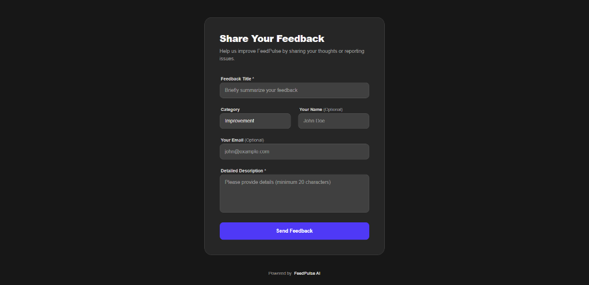
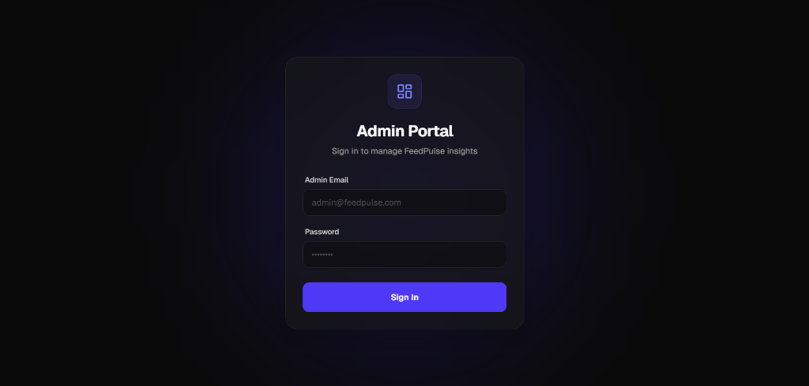
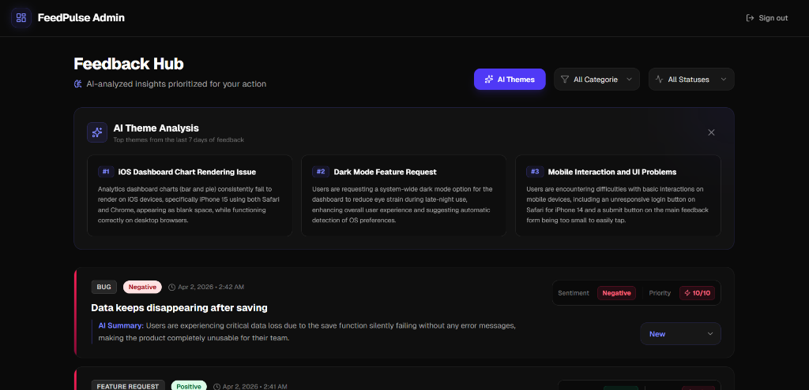

<p align="center">
  
  
  
  
  
  
  
</p>

# 🚀 FeedPulse

**AI-Powered Product Feedback Platform**

FeedPulse is a full-stack feedback management system that leverages **Google Gemini AI** to automatically analyze, categorize, and prioritize user feedback in real-time. Built for product teams who want actionable insights — not just a pile of tickets.

---

## ✨ Features

| Feature | Description |
|---|---|
| **🧠 AI Analysis** | Every feedback submission is automatically analyzed by Gemini AI for sentiment, priority scoring (1-10), category, summary, and tags |
| **🎯 Theme Detection** | One-click AI theme analysis identifies the top 3 recurring patterns from the last 7 days of feedback |
| **⚡ Circuit Breaker** | Built-in circuit breaker pattern prevents cascading failures when the Gemini API is unavailable |
| **🔄 Rule-Based Fallback** | When AI is down, a keyword-based fallback analyzer ensures feedback is never left unprocessed |
| **💀 Dead Letter Queue** | Feedback items that permanently fail AI analysis are surfaced in an admin banner for one-click bulk retry |
| **🔐 JWT Authentication** | Secure admin dashboard with token-based authentication |
| **🐳 Docker Ready** | Full Docker Compose setup — one command to run the entire stack |

---

## 📸 Screenshots

### Public Feedback Form
> Users can submit feedback without authentication — clean, minimal interface.



### Admin Login
> Secure JWT-authenticated admin portal with a sleek glassmorphism design.



### Admin Dashboard
> AI-analyzed feedback hub with sentiment badges, priority scores, AI theme analysis, filters, and status management.



---

## 🏗️ Architecture

```
FeedPulse/
├── backend/                  # Node.js + Express + TypeScript API
│   ├── src/
│   │   ├── controllers/      # Request handlers
│   │   ├── middleware/        # JWT auth middleware
│   │   ├── models/           # Mongoose schemas
│   │   ├── routes/           # Express route definitions
│   │   ├── services/         # Gemini AI + Fallback analyzers
│   │   ├── utils/            # Circuit breaker, response helpers
│   │   └── server.ts         # Entry point with MongoDB retry logic
│   └── Dockerfile
├── frontend/                 # Next.js 14 + Tailwind CSS
│   ├── src/
│   │   ├── app/
│   │   │   ├── page.tsx          # Public feedback form
│   │   │   └── dashboard/
│   │   │       └── page.tsx      # Admin dashboard
│   │   └── context/              # Auth context provider
│   └── Dockerfile
├── docker-compose.yml
└── .env.example
```

---

## 🚀 Getting Started

### Prerequisites

- **Node.js** 20+
- **MongoDB** running locally (or use Docker — see below)
- **Google Gemini API Key** ([Get one here](https://aistudio.google.com/apikey))

### Local Development

**1. Clone the repository**
```bash
git clone https://github.com/Janith-01/FeedPulse.git
cd FeedPulse
```

**2. Set up the backend**
```bash
cd backend
cp .env.example .env        # Fill in GEMINI_API_KEY, JWT_SECRET, etc.
npm install
npm run dev                  # Starts on http://localhost:3000
```

**3. Set up the frontend**
```bash
cd frontend
npm install
npm run dev                  # Starts on http://localhost:3001
```

**4. Or run both at once from the project root**
```bash
npm install                  # Installs concurrently
npm run dev                  # Starts backend + frontend together
```

---

## 🐳 Running with Docker

### Prerequisites
- [Docker](https://docs.docker.com/get-docker/) and [Docker Compose](https://docs.docker.com/compose/install/) installed

### Steps

**1. Copy the env template and fill in your secrets**
```bash
cp .env.example .env
```

> **Required:** Set `GEMINI_API_KEY` and `JWT_SECRET` at minimum.

**2. Build and start all services**
```bash
docker-compose up --build
```

This starts **MongoDB**, the **backend API**, and the **Next.js frontend** — all wired together.

**3. Open the app**

| Service | URL |
|---|---|
| Public Feedback Form | [http://localhost:3001](http://localhost:3001) |
| Admin Dashboard | [http://localhost:3001/dashboard](http://localhost:3001/dashboard) |
| Backend API | [http://localhost:3000](http://localhost:3000) |

### Stopping

```bash
docker-compose down          # Stop containers, keep the database
docker-compose down -v       # Stop containers AND wipe the database volume
```

---

## 🔑 API Reference

### Public Endpoints

| Method | Endpoint | Description |
|---|---|---|
| `POST` | `/api/feedback` | Submit new feedback |
| `GET` | `/api/health` | Health check + circuit breaker status |

### Admin Endpoints (JWT Required)

| Method | Endpoint | Description |
|---|---|---|
| `POST` | `/api/auth/login` | Admin login → returns JWT token |
| `GET` | `/api/feedback` | List all feedback (paginated, filterable) |
| `GET` | `/api/feedback/:id` | Get single feedback item |
| `PATCH` | `/api/feedback/:id` | Update feedback status |
| `DELETE` | `/api/feedback/:id` | Delete feedback item |
| `GET` | `/api/feedback/summary` | AI-generated theme summary (last 7 days) |
| `GET` | `/api/admin/dead-queue` | View dead letter queue items |
| `POST` | `/api/admin/dead-queue/retry-all` | Retry all failed AI analysis items |

---

## ⚙️ Environment Variables

| Variable | Required | Description |
|---|---|---|
| `GEMINI_API_KEY` | ✅ | Google Gemini API key for AI analysis |
| `JWT_SECRET` | ✅ | Secret key for signing JWT tokens |
| `ADMIN_EMAIL` | ✅ | Admin login email |
| `ADMIN_PASSWORD` | ✅ | Admin login password |
| `MONGO_URI` | ❌ | MongoDB connection string (defaults to `localhost`) |
| `PORT` | ❌ | Backend port (defaults to `3000`) |

---

## 🧠 AI Pipeline

```
Feedback Submitted
        │
        ▼
  ┌─────────────┐
  │  Gemini AI   │──── Success ──▶ Save AI fields ──▶ ai_processed = true
  │  (Primary)   │
  └──────┬───────┘
         │ Failed / Circuit Open
         ▼
  ┌─────────────┐
  │  Rule-Based  │──── Always ──▶ Save AI fields ──▶ ai_processed = true
  │  Fallback    │                                    ai_last_error = "fallback"
  └──────────────┘
```

**Fallback Rules:**
- **Sentiment:** Keyword matching against curated positive/negative word lists
- **Priority:** Scored 1-10 based on sentiment, description length, and urgency keywords
- **Summary:** First 100 characters trimmed to the last complete word
- **Tags:** Extracted capitalized words (4+ chars) from title and description

---

## 📜 License

ISC © [Janith-01](https://github.com/Janith-01)
